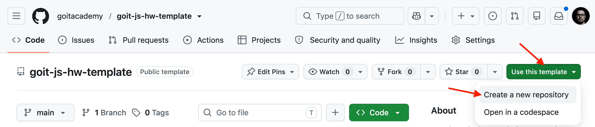
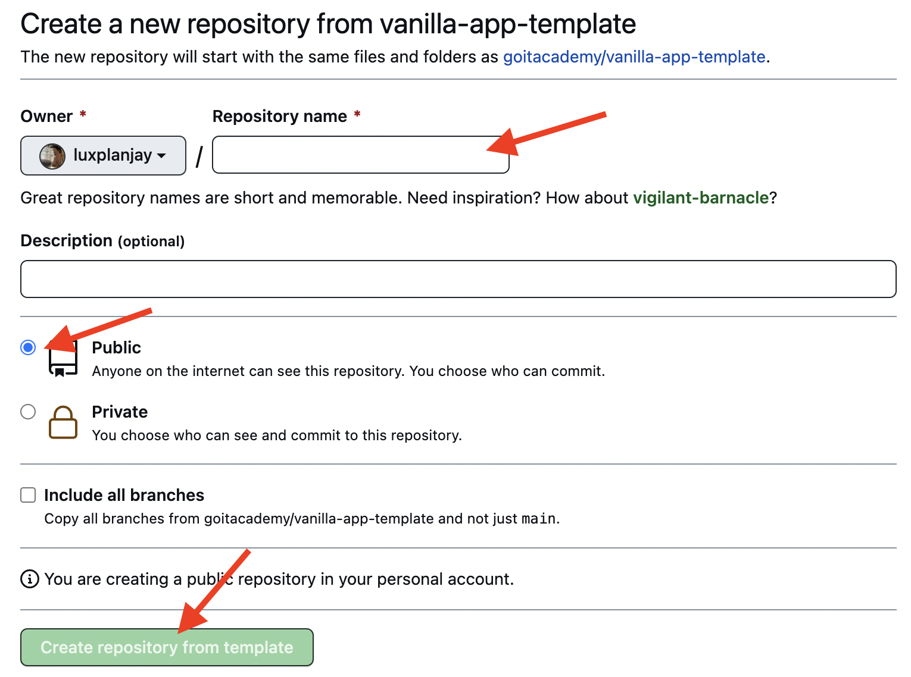

# goit-js-hw-template

Стартовий шаблон для домашніх робіт №9–12 блоку **JavaScript**. Зібраний на
[Vite](https://vite.dev/): локальний дев-сервер, збірка в продакшн і
автоматичний деплой живої сторінки на GitHub Pages.

## 1. Створи репозиторій зі шаблону

Натисни зелену кнопку **Use this template** і обери опцію
**Create a new repository**.



Відкриється сторінка нового репозиторію. Назви його за номером завдання
(`goit-js-hw-09`, `goit-js-hw-10` і так далі до `goit-js-hw-12`), переконайся, що
репозиторій **публічний** (Public), і натисни **Create repository from
template**.



## 2. Увімкни живу сторінку (GitHub Pages)

Одразу після створення репозиторію:

1. Відкрий **Settings → Pages**.
2. У розділі **Source** обери **GitHub Actions**.


Тепер щоразу, коли ти пушиш у гілку `main`, GitHub автоматично збирає проєкт і
оновлює живу сторінку. Посилання на неї зʼявиться там само, у **Settings →
Pages** (перший деплой — за хвилину-дві після першого пушу з твоїм кодом).

Адреса матиме вигляд `https://<твій-нік>.github.io/<назва-репозиторію>/` — шлях у
ній завжди дорівнює назві твого репозиторію (збірка підставляє її автоматично).

## 3. Запусти проєкт локально

Склонуй свій новий репозиторій на компʼютер, відкрий у VS Code і в терміналі:

```bash
npm install     # один раз після клону — ставить залежності
npm run dev     # запускає дев-сервер, адреса зʼявиться в терміналі
```

Відкрий адресу з терміналу (зазвичай `http://localhost:5173`) у браузері.
Сторінка сама оновлюється, коли ти зберігаєш файли.

## 4. Пиши код

- Розмітку — у `src/index.html`.
- JavaScript — у `src/main.js`. Додаткові модулі створюй поруч у `src/` і
  імпортуй їх у `main.js`.
- Стилі — у `src/css/styles.css`.

Якщо за завданням потрібно кілька сторінок — додай ще `.html`-файли в `src/`
(наприклад `src/gallery.html`), збірка підхопить їх автоматично.

Якщо завдання вимагає сторонніх бібліотек — встанови їх через `npm` за
інструкцією в описі домашнього завдання.
